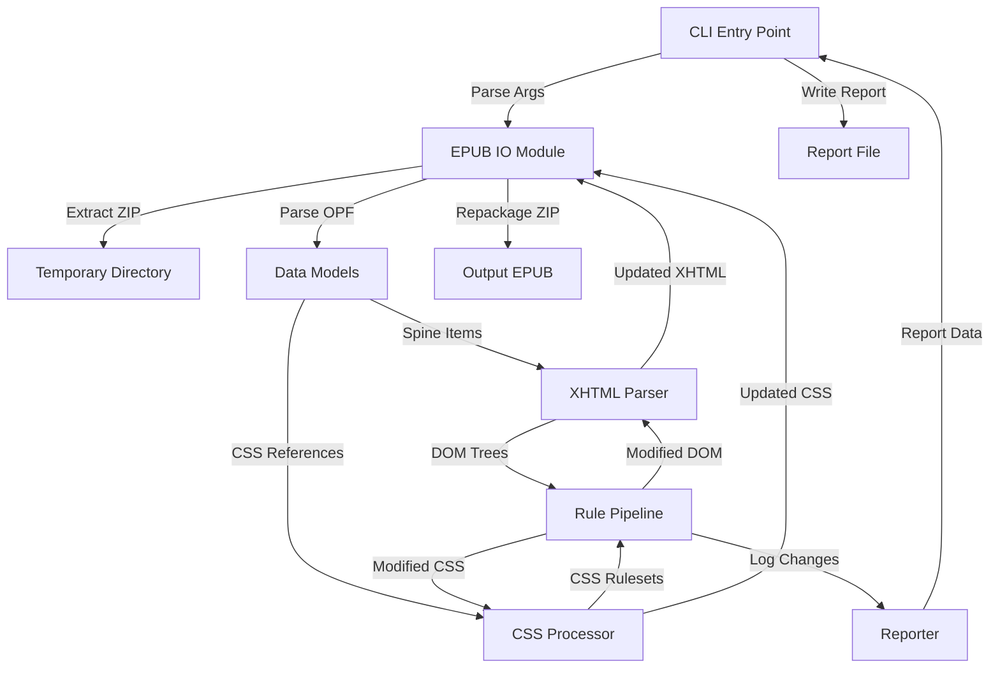

# EPUB Tools Architecture

## Overview

The EPUB Tools suite consists of two main components:

1. **EPUB Repair**: A Python-based CLI/GUI application that repairs formatting issues in reflowable EPUB files. It focuses on semantic structure (XHTML) and styling (CSS) normalization without altering textual content.

2. **EPUB Upgrade**: A Python-based CLI tool that detects EPUB versions and upgrades EPUB 2 files to EPUB 3, including NCX to nav.xhtml conversion and metadata validation.

Both tools share common I/O utilities and can be used together for a complete EPUB processing workflow.

## System Architecture

### High-Level Data Flow



### Core Components

#### 1. CLI Module (`cli.py`)

**Responsibilities:**
- Parse command-line arguments (`epub-format-fix INPUT.epub -o OUTPUT.epub`)
- Handle options: `--safe`, `--aggressive`, `--report`
- Orchestrate the repair pipeline
- Write report output (JSON or text)

**Key Functions:**
- `main()` - Entry point
- Argument parsing and validation
- Pipeline orchestration

#### 2. EPUB IO Module (`epub_io.py`)

**Responsibilities:**
- Extract EPUB (ZIP) to temporary directory
- Locate and parse `META-INF/container.xml`
- Find and parse OPF package file
- Identify content documents (XHTML) and stylesheets (CSS) from manifest and spine
- Repackage modified files back into EPUB (ZIP) format
- Preserve non-content files (images, fonts, metadata)

**Key Functions:**
- `extract_epub(epub_path, temp_dir)` - Extract ZIP to directory
- `parse_container(container_path)` - Find OPF reference
- `parse_opf(opf_path)` - Parse manifest and spine
- `repackage_epub(temp_dir, output_path)` - Create new EPUB ZIP

#### 3. Data Models (`models.py`)

**Responsibilities:**
- Represent EPUB structure in memory
- Provide access to spine order and manifest items
- Resolve file paths relative to EPUB root

**Key Classes:**

- `EpubBook`
  - `root_path: Path` - Filesystem path to extracted EPUB root
  - `opf_path: Path` - Path to OPF file
  - `spine_items: List[SpineItem]` - Ordered reading sequence
  - `manifest_items: Dict[str, ManifestItem]` - ID to manifest entry mapping

- `SpineItem`
  - `idref: str` - Reference to manifest ID
  - `href: Path` - Resolved path to content document

- `ManifestItem`
  - `id: str` - Unique identifier
  - `href: Path` - Relative path to resource
  - `media_type: str` - MIME type (e.g., `application/xhtml+xml`)

#### 4. XHTML Parser (`xhtml_parser.py`)

**Responsibilities:**
- Load XHTML files into DOM/tree representation
- Provide query helpers for common elements (headings, paragraphs, lists)
- Serialize DOM back to well-formed XHTML
- Handle malformed HTML gracefully

**Key Functions:**
- `parse_xhtml(file_path)` - Load XHTML into DOM
- `find_headings(tree)` - Locate heading elements
- `find_paragraphs(tree)` - Locate paragraph elements
- `find_lists(tree)` - Locate list elements
- `serialize_xhtml(tree)` - Convert DOM to XHTML string

**Dependencies:**
- `lxml.html` or `beautifulsoup4` for parsing

#### 5. CSS Processor (`css_processor.py`)

**Responsibilities:**
- Parse CSS into structured ruleset representation
- Allow modification of CSS rules (add/remove/change properties)
- Serialize rulesets back to clean CSS text
- Handle CSS parsing errors gracefully

**Key Functions:**
- `parse_css(css_text)` - Parse CSS into rulesets
- `modify_rule(ruleset, selector, property, value)` - Update CSS property
- `remove_property(ruleset, selector, property)` - Remove CSS property
- `serialize_css(rulesets)` - Convert rulesets to CSS string

**Dependencies:**
- `tinycss2` or similar CSS parser

#### 6. Rule Engine (`rules/`)

**Responsibilities:**
- Apply formatting repair rules in sequence
- Modify XHTML DOM and CSS rulesets
- Log changes via Reporter

**Rule Pipeline:**

```python
SAFE_RULES = [
    headings.normalize_headings,
    paragraphs.normalize_paragraphs_and_indents,
    lists.normalize_lists,
    breaks.normalize_context_breaks,
    images.normalize_images,
    css_cleanup.simplify_css_safe,
]

AGGRESSIVE_RULES = SAFE_RULES + [
    css_cleanup.simplify_css_aggressive,
]
```

**Rule Function Signature:**
```python
def rule(book: EpubBook, reporter: Reporter) -> None:
    """Apply rule transformations to book content."""
```

**Rule Modules:**

- `headings.py` - Convert fake headings to semantic `<h1>`-`<h3>`
- `paragraphs.py` - Normalize paragraph structure and indentation
- `lists.py` - Convert visual lists to semantic `<ul>`/`<ol>`
- `breaks.py` - Normalize scene breaks and spacing
- `images.py` - Ensure image accessibility and sizing
- `css_cleanup.py` - Simplify CSS (safe and aggressive modes)

#### 7. Reporter (`reporting.py`)

**Responsibilities:**
- Collect statistics and change logs from rules
- Generate summary reports (JSON or text)
- Track counts per rule category

**Key Classes:**

- `Reporter`
  - `increment(category, count)` - Increment counter
  - `log_change(file_path, description)` - Record specific change
  - `get_summary()` - Return summary dictionary
  - `write_json(path)` - Output JSON report
  - `write_text(path)` - Output text report

## Processing Pipeline

### Step-by-Step Flow

1. **CLI Parsing**
   - Parse input EPUB path, output path, and options
   - Determine rule set (safe vs aggressive)

2. **EPUB Extraction**
   - Extract EPUB ZIP to temporary directory
   - Locate `META-INF/container.xml`
   - Parse OPF to build `EpubBook` model

3. **Content Identification**
   - Extract spine items (ordered content documents)
   - Identify all XHTML files in reading order
   - Identify all referenced CSS files

4. **Content Parsing**
   - Parse each XHTML file into DOM trees
   - Parse each CSS file into rulesets
   - Store parsed content in memory

5. **Rule Application**
   - Iterate through selected rule set (safe or aggressive)
   - Each rule receives `EpubBook` and `Reporter`
   - Rules modify DOM trees and CSS rulesets in-place
   - Rules log changes via Reporter

6. **Serialization**
   - Serialize modified DOM trees back to XHTML
   - Serialize modified CSS rulesets back to CSS
   - Write updated files to temporary directory

7. **Repackaging**
   - Create new EPUB ZIP from temporary directory
   - Preserve all original files except modified XHTML/CSS
   - Ensure `mimetype` is first entry (uncompressed)

8. **Reporting**
   - Generate report from Reporter data
   - Write report file (JSON or text) if requested
   - Display summary to console

## External Dependencies

- **Python 3.11+** - Minimum runtime version
- **lxml** or **beautifulsoup4** - XHTML parsing and serialization
- **tinycss2** or similar - CSS parsing and manipulation
- **Standard library** - `zipfile`, `tempfile`, `pathlib`, `xml.etree` or `lxml.etree`

## Design Principles

1. **Separation of Concerns** - Each module has a single, well-defined responsibility
2. **Rule-Based Architecture** - Formatting fixes are isolated, composable rules
3. **Non-Destructive** - Original files preserved; modifications are explicit
4. **Extensibility** - New rules can be added without modifying core pipeline
5. **Testability** - Each component can be tested independently

## Future Considerations

- **macOS GUI** - Architecture supports future GUI layer that calls the same core engine
- **Additional Rules** - Rule pipeline can be extended with new formatting rules
- **Validation** - Could add EPUB validation step before/after processing
- **Batch Processing** - CLI could be extended to process multiple EPUBs
